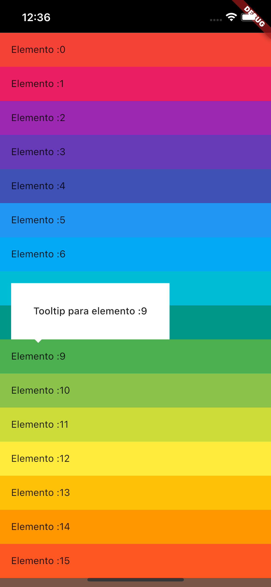

# Tooltip

Aprende a crear un tooltip sin ningun paquete externo de una manera sencilla.

## Instalación

Ejecutar el siguiente comando en la raiz del proyecto para instalar las dependencias
```
flutter pub get
```

## Levantar la aplicacion

Seleccione un dispositivo movil y levante la aplicación

```
flutter run
```

## Imagenes de la aplicacion 
<p float="left">
   
   
</p>


